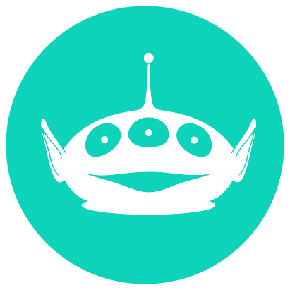

<h1 align="center">
   
  
   
  Greenddit
   
</h1>

## English | [Português](#pt-readme)

[Greenddit]() is a front-end project developed at Labenu's bootcamp and it is based on Reddit.

Create posts, comment and vote!

This application uses an API developed by Labenu.
This project was bootstrapped with [Create React App](https://github.com/facebook/create-react-app).

- [Features](#features)
- [Libs and Frameworks](#libs)

## ✦ Features:
* Signup
* Login
* Make a post
* Check post details
* Upvote or downvote posts or comments
* Leave a comment in a post
* Search for a post or a user

## ✦ Libraries and Frameworks
* React
* Axios
* styled-components
* Chakra-UI

*Developed with 💚 by Nicole Zolnier*

-------

## [English](#en-readme) | Português
[Greenddit]() é um projeto front-end feito no bootcamp da Labenu e baseado no Reddit.

Crie posts, comente e vote neles!

Esse projeto utiliza uma API desenvolvida pela Labenu. Projeto desenvolvido com [Create React App](https://github.com/facebook/create-react-app).

- [Funcionalidades](#funcionalidades)
- [Bibliotecas e Frameworks](#bibliotecas)

## ✦ Funcionalidades:
* Cadastro
* Login
* Fazer um post
* Ver detalhes de uma post
* Votar para cima ou para baixo em posts ou comentários
* Comentar em um post
* Pesquisar por um post ou um usuário

## ✦ Bibliotecas e Frameworks
* React
* Axios
* styled-components
* Chakra-UI

*Desenvolvido com 💚 por Nicole Zolnier*